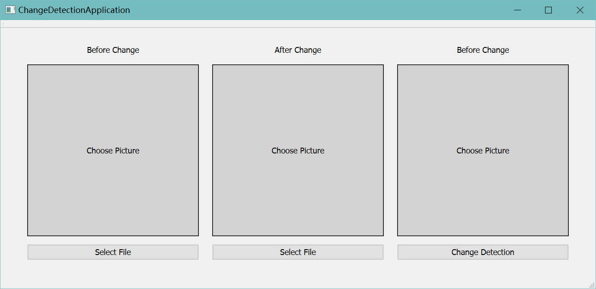
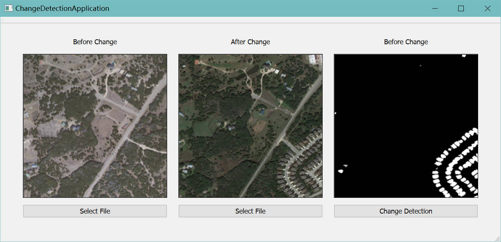

一个变化检测结果展示的可视化界面

- 从本地选择一张变化前的影像
- 从本地选择一张变化后的影像
- 调用python脚本生成期间变化的区域

需要本地有python环境，详见 PyFiles/requirements.txt

torch==2.1.0
numpy==1.24.3
torchvision==0.16.0
Pillow==9.4.0
python==3.8.10

配置好环境可以运行 x64/Debug 中的 .exe文件

界面：

结果：

生成的检测结果会保存在 PyFiles/predict_results 中
